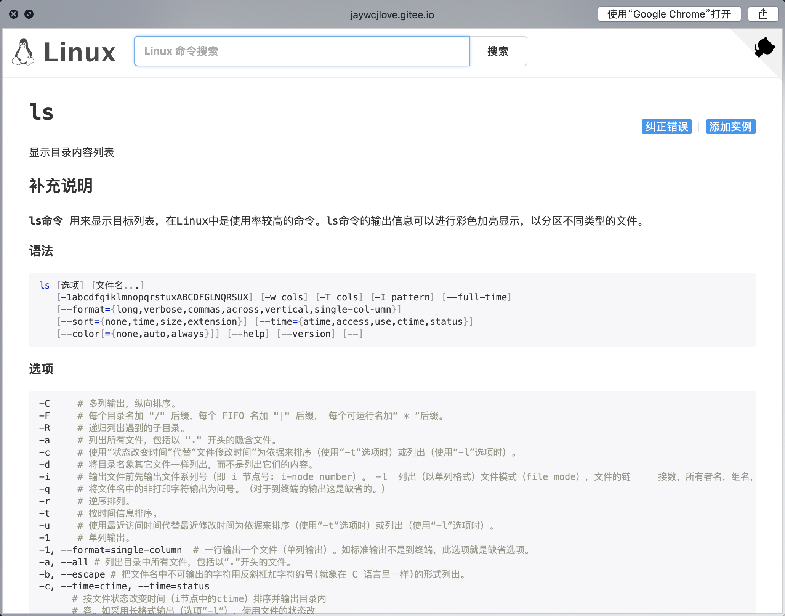

# alfred-linux-command

> Linux 命令搜索查询工具

- 查询数据自动更新, 缓存 24 小时
- 数据来源: [linux-command](https://github.com/jaywcjlove/linux-command)

## Install

```bash
  npm i -g alfred-linux-command
```

*Requires [Node.js](https://nodejs.org) 10+ and the Alfred [Powerpack](https://www.alfredapp.com/powerpack/).*

## Usage

- 输入 `lc` 触发查询, `回车键`跳转到命令文档页:


- `shift` 键快速预览:


## License

MIT © [roojay](https://roojay.com)
